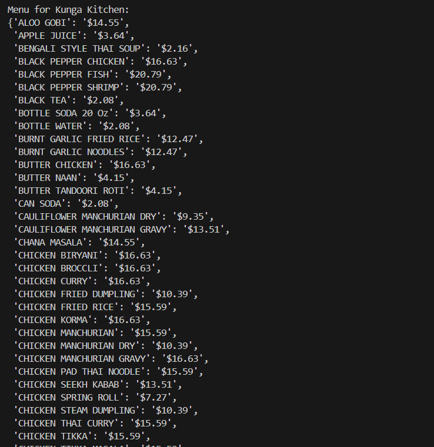

### Steps to Run

1. **Clone or Download the Repository**  
   Clone the repository or download the ZIP file and extract it. Navigate to the root folder of the project:
   ```bash
   cd DynamicPrice
   ```
2. **Create a .env file**  
   Create a .env file in to the root folder and paste the below in it:

   ```bash
   YELP_API_KEY = <YOUR YELP API KEY>
   OPENWEATHER_API_KEY = <YOUR OPEN WEATHER API KEY>
   ```

## Features and Usage

### [1] Get Lowest Local Price

Fetch and display information about a specific restaurant (e.g., "Village") along with comparable data from nearby top-rated restaurants.

#### Process:
- Retrieve the following details for the restaurant "Village" using the Yelp API:
  - Name
  - Address
  - Open times
  - Menu items and prices
- Fetch the top 5 highest-rated restaurants within a 2 km radius offering similar menu items.
- Display the menu items and prices for "Village" and the comparable restaurants.

#### Run Command:
```bash
python ./restaurants.py
```

#### Example Output:





---

### [2] Get Busy Times and Bad Weather

Analyze the restaurant's busyness and the weather conditions near its location.

#### Process:
- Retrieve the busy times for "Village" by Scrapping.
- Fetch the current temperature and rain data for the location.
- Display the busyness and weather conditions.

#### Run Command:
```bash
python ./busy_and_weather.py
```

#### Example Output:


---

### [3] Display Predicted Prices

Use a machine learning model to predict dynamic prices for menu items based on weather conditions, busyness, and demand.

#### Logic:
- If:
  - Temperature is below 45°F (API returns Kelvin; convert to Fahrenheit).
  - Moderate or heavy rain is predicted.
  - The restaurant is busier than usual.
- Then:
  - Set prices above the lowest local price.
- Else:
  - Set prices to the lowest local price.

#### Setup:
1. Download the pre-trained machine learning models from [this link](https://drive.google.com/file/d/1HPN_xZ6ueGoO63M3MfFIYRJNoXGv3kXp/view?usp=sharing).
2. Extract the models and place them in the root folder of the project.

#### Run Command:
```bash
python ./prediction.py
```

#### Example Output:


---
